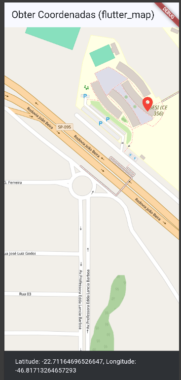
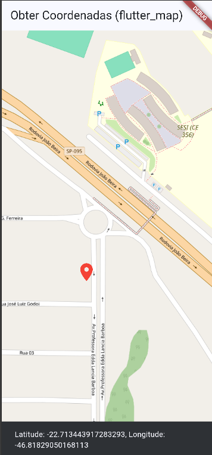

# 🗺️ Flutter Map

Aplicativo desenvolvido em Flutter como desafio da disciplina de desenvolvimento mobile.

O projeto utiliza o pacote **flutter_map** para apresentar um mapa interativo utilizando o **OpenStreetMap**. O usuário pode clicar em qualquer ponto do mapa para obter sua latitude e longitude, além de visualizar um marcador indicando o local selecionado.

## 🎯 Objetivo

O objetivo do projeto é praticar a utilização de mapas em aplicativos Flutter, trabalhando com coordenadas geográficas, interação com o mapa e posicionamento de marcadores.

## 🚀 Funcionalidades

* Exibição de um mapa utilizando o OpenStreetMap;
* Localização inicial definida na região do SESI de Amparo;
* Clique em qualquer ponto do mapa;
* Captura da latitude e longitude;
* Exibição das coordenadas na tela;
* Marcador vermelho no ponto selecionado.

## 🛠️ Tecnologias utilizadas

* Flutter
* Dart
* flutter_map
* latlong2
* OpenStreetMap

## 📍 Como funciona

Ao abrir o aplicativo, o mapa é apresentado com uma localização inicial.

Ao clicar em um ponto do mapa, o aplicativo identifica as coordenadas do local e apresenta a latitude e a longitude em uma mensagem na tela. Também é adicionado um marcador vermelho no ponto selecionado.

## 📸 Prints do aplicativo

### Tela inicial



### Ponto selecionado no mapa



## ▶️ Como executar

Clone o repositório:

```bash
git clone COLOQUE_AQUI_O_LINK_DO_REPOSITORIO
```

Entre na pasta do projeto:

```bash
cd flutter_apllication_maps
```

Instale as dependências:

```bash
flutter pub get
```

Execute o aplicativo:

```bash
flutter run
```

Também é possível executar no navegador:

```bash
flutter run -d chrome
```

## 👩‍💻 Desenvolvido por

**Mirella Brolezi**

Projeto desenvolvido para fins acadêmicos no curso de **Desenvolvimento de Sistemas – SENAI**.
